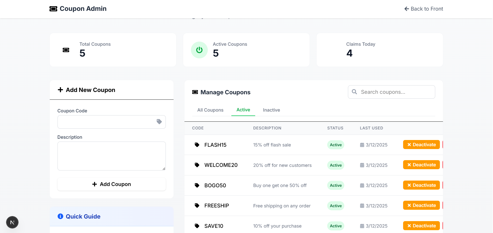

# Premium Coupon Distribution System

A modern, visually stunning web application that distributes exclusive promotional coupons to users in a round-robin manner, with robust measures to prevent abuse and ensure fair distribution.

## 🌟 Features

- **Fair Distribution**: Coupons are assigned sequentially in a round-robin fashion
- **Abuse Prevention**: IP tracking and browser fingerprinting prevent multiple claims
- **No Login Required**: Fully accessible to guest users without account creation
- **Fully Responsive**: Sleek, modern UI that works beautifully on all devices
- **Admin Dashboard**: Easy management of coupons with real-time statistics
- **Premium UI/UX**: Glassmorphism design, smooth animations, and gradient effects for a luxury feel

## 🚀 Live Demo

Check out the live demo: [Premium Coupon System](https://your-deployment-url.vercel.app)




## 💻 Tech Stack

- **Frontend**: Next.js 14+, React, Tailwind CSS
- **Backend**: Next.js API Routes
- **Database**: Supabase (PostgreSQL)
- **Deployment**: Vercel
- **Animation**: Framer Motion
- **Additional Libraries**: 
  - cookies-next for cookie management
  - nanoid for unique browser fingerprinting
  - react-toastify for toast notifications
  - react-confetti for celebration effects
  - react-icons for beautiful UI elements

## 🏗️ Project Structure

```
premium-coupons/
├── app/
│   ├── components/           # Reusable UI components
│   │   ├── AnimatedButton.js
│   │   ├── ConfettiEffect.js
│   │   ├── CountdownTimer.js
│   │   └── CouponCard.js
│   ├── admin/                # Admin dashboard
│   │   └── page.js
│   ├── api/                  # Backend API endpoints
│   │   ├── claim-coupon/
│   │   │   └── route.js
│   │   └── check-status/
│   │       └── route.js
│   ├── page.js               # Main coupon claim page
│   ├── layout.js             # App layout with metadata
│   ├── globals.css           # Global styles
│   └── components.css        # Component-specific styles
├── lib/
│   └── supabaseClient.js     # Database connection
├── public/
│   └── screenshot.png        # App screenshot for README
├── package.json
├── postcss.config.mjs        # Tailwind configuration
└── README.md
```

## 🔧 Installation and Setup

### Prerequisites

- Node.js 18.x or higher
- npm or yarn
- Supabase account

### Setup Steps

1. **Clone the repository**
   ```bash
   git clone https://github.com/OmkarJadhav2020/round-robin-coupan.git
   cd premium-coupons
   ```

2. **Install dependencies**
   ```bash
   npm install
   # or
   yarn install
   ```

3. **Set up environment variables**
   
   Create a `.env.local` file in the project root:
   ```
   NEXT_PUBLIC_SUPABASE_URL=your-supabase-url
   NEXT_PUBLIC_SUPABASE_ANON_KEY=your-supabase-anon-key
   COOLDOWN_PERIOD_MINUTES=60
   ```

4. **Set up the database**
   
   Execute the following SQL in your Supabase SQL editor:
   ```sql
   -- Create coupons table
   CREATE TABLE coupons (
     id SERIAL PRIMARY KEY,
     code VARCHAR(20) UNIQUE NOT NULL,
     description TEXT,
     is_active BOOLEAN DEFAULT TRUE,
     created_at TIMESTAMP WITH TIME ZONE DEFAULT NOW(),
     last_assigned_at TIMESTAMP WITH TIME ZONE
   );

   -- Create claims table
   CREATE TABLE claims (
     id SERIAL PRIMARY KEY,
     coupon_id INTEGER REFERENCES coupons(id),
     ip_address VARCHAR(50) NOT NULL,
     browser_id VARCHAR(100) NOT NULL,
     claimed_at TIMESTAMP WITH TIME ZONE DEFAULT NOW()
   );

   -- Create indexes for faster lookups
   CREATE INDEX idx_claims_ip_address ON claims(ip_address);
   CREATE INDEX idx_claims_browser_id ON claims(browser_id);

   -- Insert sample coupons
   INSERT INTO coupons (code, description) VALUES 
   ('PREMIUM10', '10% off premium subscriptions'),
   ('FREESHIP', 'Free express shipping on any order'),
   ('VIP25', '25% off for VIP members'),
   ('WELCOME20', '20% off for new customers'),
   ('FLASH50', '50% off flash sale - today only!');
   ```

5. **Run the development server**
   ```bash
   npm run dev
   # or
   yarn dev
   ```

6. **Open your browser**
   
   Navigate to [http://localhost:3000](http://localhost:3000) to see the application.

## 🚢 Deployment

The easiest way to deploy this application is through Vercel:

1. Push your code to a GitHub repository
2. Sign up for a [Vercel](https://vercel.com) account
3. Import your GitHub repository
4. Add your environment variables in the Vercel project settings
5. Deploy!

## 🛡️ Abuse Prevention Mechanisms

The application employs multiple layers of protection to ensure fair distribution:

1. **IP Address Tracking**: Restricts multiple claims from the same IP address within the cooldown period
2. **Browser Fingerprinting**: Uses cookies to identify unique browsers regardless of IP changes
3. **Cooldown Period**: Configurable time restriction between claims with visual countdown
4. **Round-Robin Distribution**: Ensures even distribution of different coupons
5. **Server-Side Validation**: All claim logic happens on the server for enhanced security

## 🎨 Premium UI Features

- **Glassmorphism**: Modern frosted glass effect for card elements
- **Gradient Animations**: Beautiful color transitions and animated backgrounds
- **Micro-interactions**: Subtle animations that respond to user actions
- **Responsive Layout**: Adapts perfectly to all screen sizes from mobile to large desktop
- **Intuitive Feedback**: Clear messages with toast notifications
- **Visual Countdown**: Circular progress timer for cooldown periods
- **Celebration Effects**: Confetti animation upon successful coupon claim
- **Copy-to-Clipboard**: One-click copying of coupon codes with visual confirmation

## 🔄 System Flow

1. **User Visits Site**: Presented with a beautifully animated interface
2. **Claim Button**: User clicks to request a coupon
3. **Server Validation**: System checks eligibility based on IP and browser ID
4. **Cooldown Check**: If user has claimed recently, displays countdown timer
5. **Coupon Assignment**: If eligible, assigns next coupon using round-robin algorithm
6. **Success Display**: Shows coupon with celebration animation and copy option
7. **Admin Management**: Separate dashboard for adding/managing coupons and viewing analytics

## 🤝 Contributing

Contributions are welcome! Feel free to open issues or submit pull requests.

1. Fork the repository
2. Create your feature branch: `git checkout -b feature/amazing-feature`
3. Commit your changes: `git commit -m 'Add some amazing feature'`
4. Push to the branch: `git push origin feature/amazing-feature`
5. Open a pull request

## 📝 License

This project is licensed under the MIT License - see the LICENSE file for details.

## 📧 Contact

If you have any questions or feedback, please reach out at [jadhavoj2023@gmail.com](mailto:jadhavoj2023@gmail.com).

---

*Elevate your promotional strategies with our Premium Coupon Distribution System - combining fair distribution, abuse prevention, and a luxury user experience.*